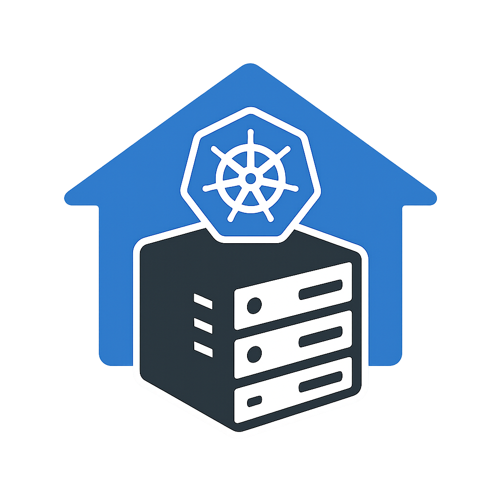

<p align="center"></p>

# KJHo.me: *A Declarative Kubernetes Homelab*

This repository serves as the single source of truth for my self-hosted Kubernetes homelab, built on GitOps principles with Flux CD. Everything is managed declaratively through code, with zero manual kubectl commands in production.

## Architecture Overview

### Core Infrastructure Stack
- **🔄 FluxCD**: GitOps continuous delivery managing all deployments
- **🔐 1Password Connect**: Direct secret synchronization from 1Password vault using Connect Operator
- **🌐 Traefik**: Ingress controller with automatic service discovery
- **🔒 cert-manager**: Automated SSL certificate management via Cloudflare
- **📦 Helm**: Package management for all applications
- **💾 Longhorn**: Distributed block storage with replication and snapshots

### Application Services
- **🗃️ PostgreSQL**: Primary database for applications
- **⚡ Redis**: Cache and session store for applications
- **📡 Cloudflare DDNS**: Dynamic DNS updates for external access
- **📊 Uptime Kuma**: Self-hosted monitoring and status pages
- **🔔 Discord Notifications**: Automated cluster alerts and status updates

### GitOps Workflow
- **Declarative**: All infrastructure and applications defined in YAML manifests
- **Automated**: Flux handles deployment, upgrades, and reconciliation
- **Secure**: Secrets stored in 1Password, never in Git
- **Validated**: Pre-commit hooks ensure manifest quality
- **Incremental**: Small, frequent commits over large changes

### Key Design Principles
- **GitOps-First**: All changes flow through Git, avoiding manual interventions
- **Minimal Complexity**: Keep deployment manifests simple and maintainable
- **Latest Versions**: Use current Helm chart and application versions
- **Separation of Concerns**: Individual files for each Kubernetes component

## Hardware Infrastructure

### Physical Nodes
- **🖥️ Intel NUCs (x3)**: Core cluster nodes with Celeron processors
  - **lognuc1**: 2 cores, 32GB RAM, 512GB SSD
  - **lognuc2**: 2 cores, 16GB RAM, 512GB SSD
  - **lognuc3**: 2 cores, 8GB RAM, 256GB SSD
- **💻 Worker VM**: High-performance node for compute-intensive workloads
  - **lognucx**: 4 cores, 4-8GB RAM, 1TB SSD (dynamic allocation)

## Deployment

### Prerequisites
- Physical nodes running Ubuntu with SSH access
- 1Password vault with required secrets configured
- GitHub repository access with personal access token
- Ansible installed on deployment machine

### Required Environment Variables
Before deploying, set the following environment variables:

```bash
# 1Password Connect API Token
export OP_CONNECT_TOKEN="your-1password-connect-api-token"

# 1Password Connect Credentials File
export OP_CONNECT_CREDENTIALS_FILE=$(cat /path/to/1password-credentials.json)

# GitHub Personal Access Token (for Flux bootstrap)
export GITHUB_PAT="your-github-personal-access-token"
```

### Deployment Steps

1. **Clone the repository**:
   ```bash
   git clone https://github.com/kylejschultz/kjho.me.git
   cd kjho.me
   ```

2. **Configure environment variables** (see above)

3. **Update inventory** if needed:
   ```bash
   # Edit provisioning/k3s-inventory.ini with your node details
   ```

4. **Deploy the cluster**:
   ```bash
   ansible-playbook -i provisioning/k3s-inventory.ini provisioning/k3s-bootstrap.yml
   ```

### What the Deployment Does
- **Installs K3s** on all nodes with proper networking
- **Deploys 1Password Connect Operator** for secret management
- **Bootstraps Flux** for GitOps continuous delivery
- **Applies all manifests** from this repository automatically
- **Sets up Discord notifications** for cluster monitoring

### Post-Deployment
After deployment completes:
- All applications will be automatically deployed via GitOps
- Secrets will be synced from 1Password vault
- SSL certificates will be issued automatically
- Services will be accessible via configured ingress routes
